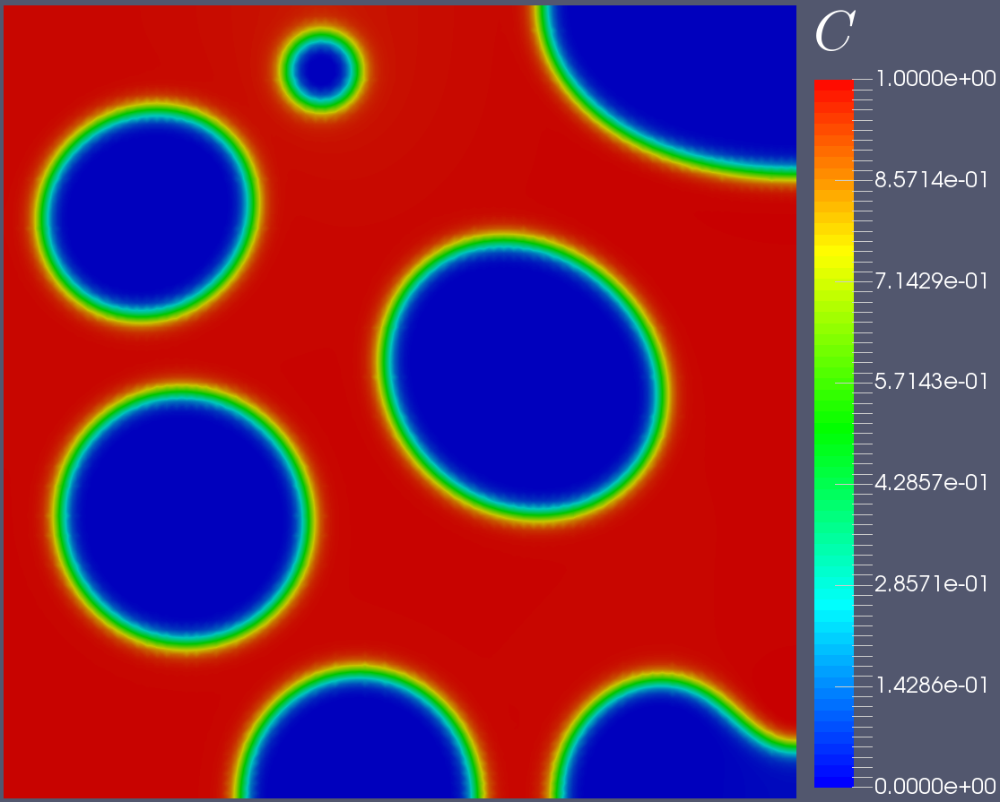

# Welcome to AsFem

This is **A** **S**imple **F**inite **E**lement **M**ethod program for the phase-field modeling and multiphysics simulation, which is short for ***AsFem***.

For efficient computation and simulation, the package is written in C++ and relies heavily on the [PETSc](https://www.mcs.anl.gov/petsc/) library. It is primarily developed for problems in solid mechanics and phase-field modeling.

CahnHilliard               |  Nonlinear Poisson
:-------------------------:|:-------------------------:
      |  
