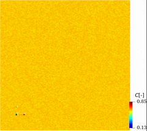
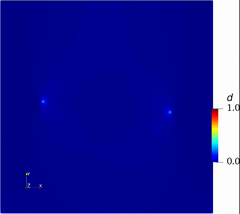

# Welcome to AsFem website

**AsFem**: **A**dvanced **S**imulation kit based on **F**inite **E**lement **M**ethod. AsFem is written in C++ and designed for phase-field modeling and multiphysics coupling. The PETSc library and MPI package are involved in AsFem for the parallel computing.

For efficient computation and simulation, the package is written in C++ and relies heavily on the [PETSc](https://www.mcs.anl.gov/petsc/) library. It is primarily developed for solid mechanics and phase-field modeling.

spinodal-decomposition     |  double-notch failure
:-------------------------:|:-------------------------:
    |  
